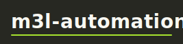
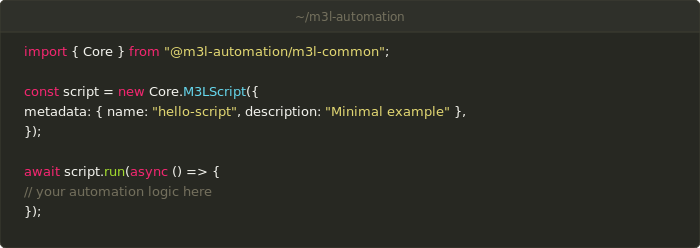

<p align="center">

</p>

<p align="center">

</p>

<p align="center">
<a href="https://github.com/monte3l/m3l-automation/actions/workflows/ci.yml"></a>
<a href="https://nodejs.org/en/">=24"></a>
<a href="https://nodejs.org/api/esm.html"></a>
<a href="https://www.typescriptlang.org/"></a>
<a href="LICENSE"></a>
<a href="docs/implementation-status.md"></a>
</p>

<p align="center">
<!-- Live shields.io endpoint badges (ADR-0032 addendum): counts are computed
     in CI on every push to main and served from GitHub Pages — these URLs
     never change, only the hosted JSON does. A new model's badge is added
     here alongside its bin/lib/claude-models.mjs allowlist entry. -->
<a href="#co-developed-with-claude"></a>
<a href="#co-developed-with-claude"></a>
<a href="#co-developed-with-claude"></a>
<a href="#co-developed-with-claude"></a>
<a href="#co-developed-with-claude"></a>
</p>

> **All 31 of 31 submodules are implemented and reviewed.** The package is
> internal and not published to npm; `version` in `package.json` is hand-managed.
> Implemented submodules: `errors`, `events`, `security`, `environment`, `utils`, `json`, `analysis`, `messaging`, `config`, `polling`, `text`, `prompt`, `exporters`, `storage`, `network`, `importers`, `files`, `logging`, `aws/models`, `script`, `aws/credentials`, `aws/clients`, `aws/dynamodb`, `aws/sqs`. See [Implementation status](docs/implementation-status.md)
> for the per-module breakdown.

A shared infrastructure library for automation scripts and AWS Lambda handlers. It provides
enterprise-grade building blocks — application scaffolding, configuration, logging, error
handling, file import/export, polling/retry resilience, and AWS credential and client management
— so consumer scripts stay free of boilerplate.

## Features

Per-module detail and coverage are tracked in
[docs/implementation-status.md](docs/implementation-status.md).

- **Application framework** — `Core.M3LScript` is a single entry point for CLI scripts and Lambda handlers, wiring together environment detection, configuration loading, logging, interactive prompts, graceful shutdown, process fault guards, and file archival.
- **Multi-source configuration** — resolve typed parameters across CLI args, JSON/YAML files, environment variables, Lambda event payloads, and presets, with static defaults and async fallbacks.
- **Structured logging** — `Core.M3LLogger` fans out to console, file, and JSON handlers; output is ANSI-rich in a TTY and machine-readable in Lambda/CI.
- **Interactive UI** — spinners, progress bars, and prompts that degrade gracefully to plain text in non-interactive environments.
- **Data I/O** — streaming CSV/JSON/text importers and CSV/JSON/HTML exporters, multi-format text extraction (PDF, DOCX, XLSX, email, ZIP), and SQLite FTS5 full-text search.
- **Resilience** — `Core.M3LPoller`, `Core.M3LRetryRunner`, backoff strategies, and composable retry classifiers; plus `M3LError` and `M3LResult<T, E>` for explicit error handling.
- **AWS integration** — `AWS.M3LAWSCredentialsManager` manages SSO credentials (validating via STS `GetCallerIdentity`), and client providers lazily create and cache AWS SDK v3 clients per profile.

## Requirements

- Node.js 24+
- ESM only (`"type": "module"`); relative imports carry the `.js` extension

## Installation

```bash
pnpm add @m3l-automation/m3l-common
```

## Quick start

```typescript
import { Core } from "@m3l-automation/m3l-common";

const script = new Core.M3LScript({
  metadata: { name: "hello-script", version: "1.0.0" },
});

await script.run(async () => {
  // your automation logic here
});
```

## Namespaces and import paths

The package exposes three import paths:

| Path                              | What you get                      |
| --------------------------------- | --------------------------------- |
| `@m3l-automation/m3l-common`      | Both namespaces: `Core` and `AWS` |
| `@m3l-automation/m3l-common/core` | The `Core` namespace directly     |
| `@m3l-automation/m3l-common/aws`  | The `AWS` namespace directly      |

```typescript
import { Core, AWS } from "@m3l-automation/m3l-common";
```

- **`Core`** — application scaffolding, configuration, logging, prompts, I/O, data utilities, and resilience primitives.
- **`AWS`** — AWS credential management and SDK client providers.

## Documentation

- [Documentation index](docs/README.md)
- [Getting started](docs/getting-started.md)
- [Implementation status](docs/implementation-status.md) — per-module progress tracker
- [Architecture overview](docs/m3l-common-architecture.md)
- [Contributing](.github/CONTRIBUTING.md)

## Co-developed with Claude

This library is co-developed by a human maintainer and Claude (via
[Claude Code](https://code.claude.com)). Stating that plainly is the point:
[Anthropic's usage policy](https://www.anthropic.com/news/usage-policy-update)
treats AI disclosure and human-in-the-loop oversight as first-class safeguards,
and this section is both.

**A human is accountable for everything that ships.** The maintainer decides
_what_ gets built — specs, ADRs, priorities, and merges — and reviews, tests,
and signs off on every change. Claude drafts _how_: implementation under a
hub-and-spoke TDD pipeline in which the agent that writes code is structurally
never the agent that reviews it (see
[CLAUDE.md § Agent Operating Model](CLAUDE.md)).

**Review is real, not nominal.** Every PR must pass the full CI quality gates
(types, lint, tests with per-file coverage thresholds, exports checks, secret
scanning) plus a mandatory blocking AI review gate, and all commits pushed to
the remote are signed. Claude's output is fallible — the work logs under
[docs/logs/](docs/logs/) record issues that review caught — which is exactly why
the gates exist: per Anthropic's own guidance, AI output should not be relied
upon without independent verification.

**What the badges above count.** Each
`Co-Authored-By: <model name> <noreply@anthropic.com>` git trailer records
which Claude model assisted a commit. It is a _provenance marker_, not a legal
authorship or copyright claim (using an AI tool does not make it a legal
co-author). The sanctioned model names live in
[bin/lib/claude-models.mjs](bin/lib/claude-models.mjs), the `commit-msg` hook
rejects non-canonical names, and the badges are **live**: on every push to
`main` a CI workflow ([pages.yml](.github/workflows/pages.yml))
counts the trailers ([bin/gen-commit-stats.mjs](bin/gen-commit-stats.mjs)) and
publishes shields.io endpoint JSON
([bin/gen-commit-stats-endpoint.mjs](bin/gen-commit-stats-endpoint.mjs)) to
GitHub Pages — no README edit, no git commit, just the hosted numbers changing
(shields caches renders for a few minutes). Merge commits, bot commits
(Dependabot, release bot), and direct human commits carry no trailer, so the
per-model badges deliberately sum to less than the repository's total commit
count — the aggregate badge shows the ratio. Which model handles which kind of task is documented in
[docs/contributing/model-selection.md](docs/contributing/model-selection.md).

## License

Apache 2.0 — see [LICENSE](LICENSE) for the full text.
